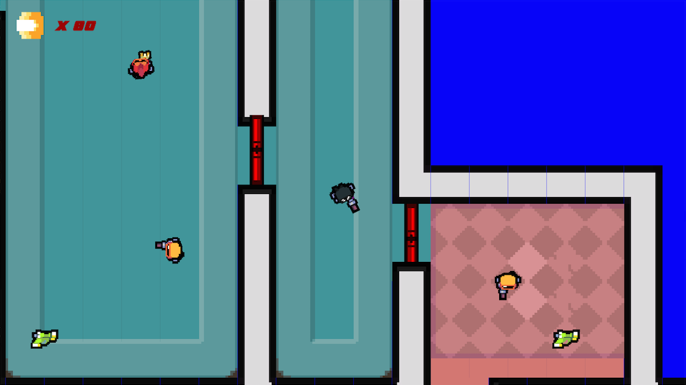
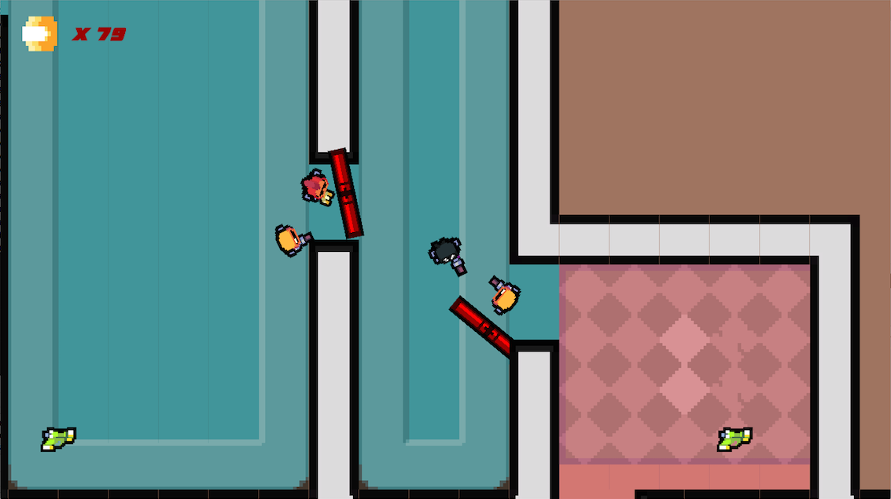

# Hotline_Miami_repro

Reproduction of Hotline Miami for a school project. Made in a team of two in 2 days. In this project, 
we had to recreate the famous indie Game Hotline Miami. This meant creating the intense die and retry 
gameplay of the original game. Among others things, those main points were implemented:
- Main character gameplay, aiming with the mouse.
- Use of close range and long range weapons, with limited ammunitions for the guns.
- Enemy placements and patrolling.
- When an enemy see the character, he comes attacking, passing through adequate doors.
- If the player shoots, the enemies in a large area are alerted and come rushing to him.

All graphical assets were provided by the school for educational purposes. All Hotline Miami copyrights belongs to their respective owners.
